# FPGA LLM RAG Platform

## Обзор

**FPGA LLM RAG** — это модульная платформа для Retrieval-Augmented Generation (RAG) с поддержкой локальных LLM (через Ollama), кастомного эмбеддинга (через float-weaver) и хранения знаний в Postgres+pgvector. Архитектура построена на микросервисах (gRPC), легко расширяется и масштабируется.

### Основные компоненты

- **llm-gateway** — gRPC-шлюз для общения с LLM (Ollama), реализует RAG-логику, агрегирует ответы.
- **rag** — сервис хранения и поиска документов (Postgres+pgvector), реализует поиск по эмбеддингам.
- **float-weaver** — сервис генерации эмбеддингов текста через модель mxbai-embed-large (или другую).
- **Ollama** — локальный сервер LLM (например, phi3), интегрируется через HTTP API.
- **Postgres** — база данных с поддержкой pgvector для хранения эмбеддингов и документов.

---

## Быстрый старт

### 1. Клонируйте репозиторий и подготовьте модели

- Для float-weaver скачайте модель [mxbai-embed-large](https://huggingface.co/mxbai-embed-large) и поместите в `float-weaver/models/mxbai-embed-large-v1`.
- Для Ollama модель (например, phi3) будет скачана автоматически или вручную через `ollama pull phi3` внутри контейнера.

### 2. Запустите все сервисы

В корне проекта:
```bash
docker-compose up --build
```
Это поднимет:
- Postgres с pgvector
- миграции схемы
- сервис эмбеддингов (float-weaver + TGI)
- сервис поиска и хранения (rag)
- Ollama (через отдельный docker-compose в llm-gateway, если нужно)
- llm-gateway (запускается отдельно, см. ниже)

### 3. Запустите llm-gateway

В отдельном терминале:
```bash
cd llm-gateway
RAG_SERVICE_ADDR=localhost:50051 OLLAMA_API_ADDR=http://localhost:11434 OLLAMA_MODEL=phi3 go run cmd/server/main.go
```
(или используйте свой docker-compose для Ollama из llm-gateway/docker-compose.yml)

---

## Архитектура



---

## ROADMAP

- [x] Базовый RAG-пайплайн (gRPC, поиск, эмбеддинг, LLM)
- [x] Интеграция с Ollama (phi3, llama3 и др.)
- [x] Поддержка кастомных эмбеддингов через float-weaver
- [x] Хранение документов и эмбеддингов в Postgres+pgvector
- [ ] Расширение RAG-пайплайна (удаление, получение конкретного документа без LLM)
- [ ] Юнит/е2е тесты
- [ ] Мониторинг и логирование (Prometheus, Grafana)
- [ ] Автоматизация деплоя (CI/CD)
- [ ] Документация и примеры интеграции

---

## Примечания

- Для работы Ollama требуется достаточно RAM (phi3 — минимум 6 ГБ).
- Если не хватает памяти — используйте более лёгкие модели (phi3-mini, llama3:8b и т.д.).
- Все сервисы можно запускать как вместе, так и по отдельности для разработки и тестирования. 