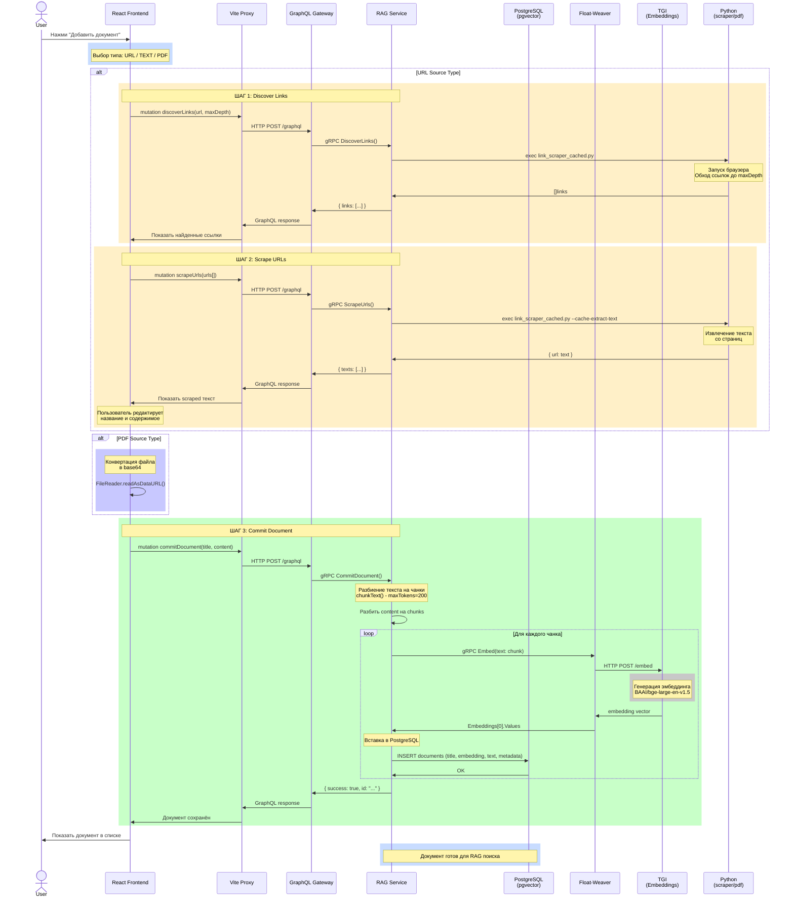

## Варианты добавления

### 1. URL
```
User → discoverLinks → scrapeUrls → commitDocument
```

### 2. TEXT  
```
User → commitDocument (напрямую с текстом)
```

### 3. PDF
```
User → base64 encode → commitDocument
```

## Ключевые операции в RAG Service:

| Операция | Описание |
|----------|----------|
| `discoverLinks` | Обход страницы, поиск всех ссылок до maxDepth |
| `scrapeUrls` | Извлечение текста с выбранных URL |
| `commitDocument` | 1) Разбить на чанки (200 токенов) → 2) Получить эмбеддинг для каждого → 3) Сохранить в pgvector |