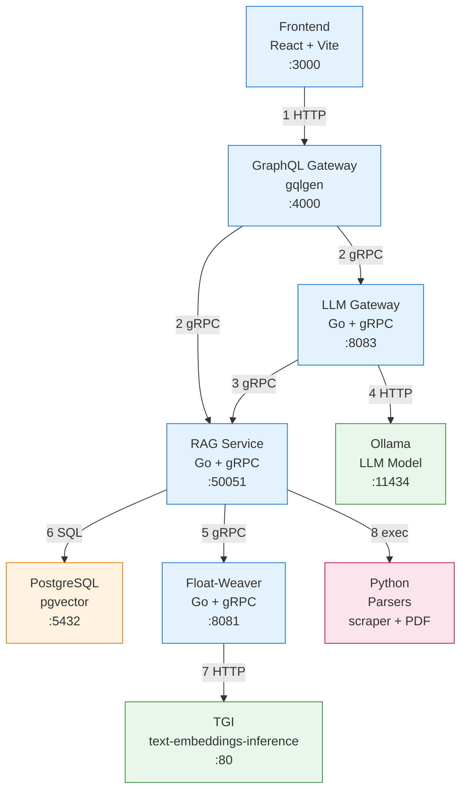
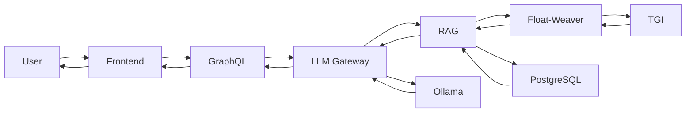
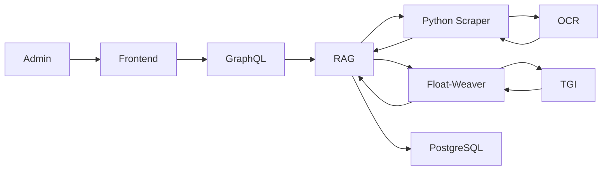
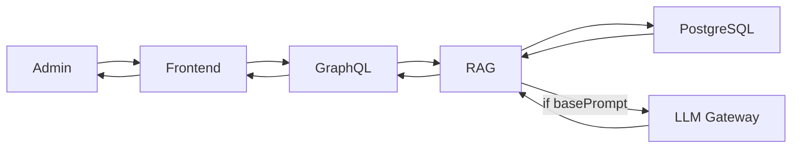

```mermaid
flowchart LR
    subgraph Frontend
        UI["Frontend (React + Vite, :3000)"]
    end

    subgraph GraphQL
        GQL["GraphQL Gateway (:4000)"]
    end

    subgraph LLM_Gateway
        LLM["LLM Gateway (:8083)"]
    end

    subgraph RAG
        RAG["RAG Service (:50051)"]
    end

    subgraph DB
        PG["PostgreSQL (:5432)"]
    end

    subgraph Embedding
        FW["Float-Weaver (:8081)"]
        TGI["TGI (:80)"]
    end

    subgraph LLM_Model
        OLL["Ollama (:11434)"]
    end

    subgraph Python
        PY["Python Parsers"]
    end

    UI -->|"HTTP /graphql"| GQL
    GQL -->|"gRPC Ask"| LLM
    GQL -->|"gRPC Search"| RAG
    GQL -->|"gRPC Preview"| RAG
    GQL -->|"gRPC Commit"| RAG
    GQL -->|"gRPC Settings"| RAG

    LLM -->|"gRPC Search"| RAG
    LLM -->|"HTTP /api/generate"| OLL

    RAG -->|"gRPC Embed"| FW
    RAG -->|"SQL"| PG

    FW -->|"HTTP /embed"| TGI

    RAG -->|"exec"| PY
```

## Full Architecture (simplified)



## Operations Flow

### Ask Question


### Add Document (URL)


### Update Settings
