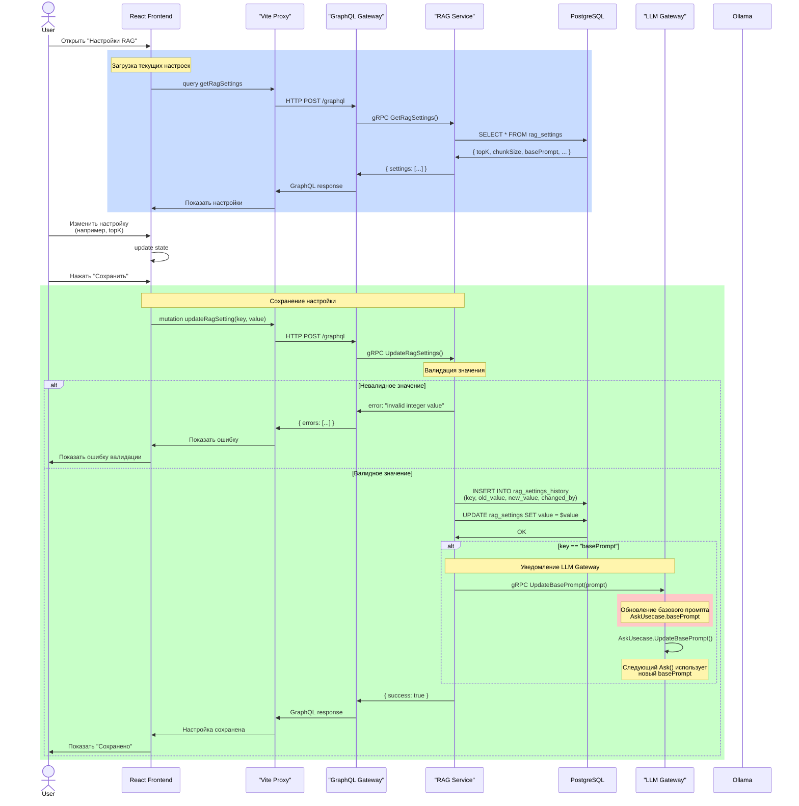
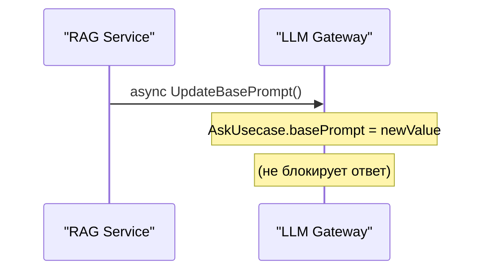

## Валидация настроек в RAG Service

| Параметр | Тип | Валидация |
|----------|-----|-----------|
| `topK` | int | Должно быть числом |
| `chunkSize` | int | Должно быть числом |
| `chunkOverlap` | int | Должно быть числом |
| `similarityThreshold` | float | Должно быть float |
| `comparisonMethod` | string | one of: cosine, dot, euclidean, l1 |
| `basePrompt` | string | **Должен содержать** "контекст" и "вопрос" (case insensitive) |

## Особенность basePrompt

При изменении `basePrompt` RAG Service **асинхронно** уведомляет LLM Gateway:
- RAG → LLM Gateway: `gRPC UpdateBasePrompt(prompt)`
- LLM Gateway → `AskUsecase.UpdateBasePrompt()` 
- Следующие запросы `Ask()` будут использовать новый промпт

