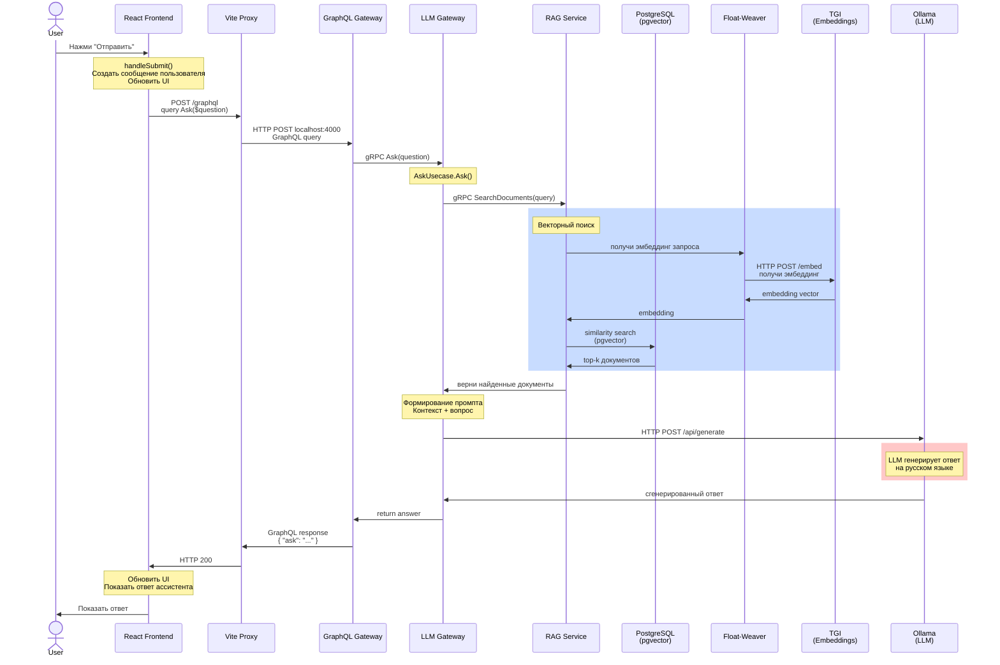

```mermaid
sequenceDiagram
    actor u as User
    participant react as React Frontend
    participant proxy as Vite Proxy
    participant gql as GraphQL Gateway
    participant llm as LLM Gateway
    participant rag as RAG Service
    participant db as PostgreSQL<br/>(pgvector)
    participant fw as Float-Weaver
    participant tgi as TGI<br/>(Embeddings)
    participant ollama as Ollama<br/>(LLM)

    u->>react: Нажми "Отправить"
    Note over react: handleSubmit()<br/>Создать сообщение пользователя<br/>Обновить UI

    react->>proxy: POST /graphql<br/>query Ask($question)

    proxy->>gql: HTTP POST localhost:4000<br/>GraphQL query

    gql->>llm: gRPC Ask(question)

    Note over llm: AskUsecase.Ask()

    llm->>rag: gRPC SearchDocuments(query)

    rect rgb(200, 220, 255)
        Note over rag: Векторный поиск
        rag->>fw: получи эмбеддинг запроса
        fw->>tgi: HTTP POST /embed<br/>получи эмбеддинг

        tgi->>fw: embedding vector

        fw->>rag: embedding

        rag->>db: similarity search<br/>(pgvector)
        db->>rag: top-k документов
    end

    rag->>llm: верни найденные документы

    Note over llm: Формирование промпта<br/> Контекст + вопрос

    llm->>ollama: HTTP POST /api/generate

    rect rgb(255, 200, 200)
        Note over ollama: LLM генерирует ответ<br/>на русском языке
    end

    ollama->>llm: сгенерированный ответ

    llm->>gql: return answer

    gql->>proxy: GraphQL response<br/>{ "ask": "..." }

    proxy->>react: HTTP 200

    Note over react: Обновить UI<br/>Показать ответ ассистента
    react->>u: Показать ответ
```